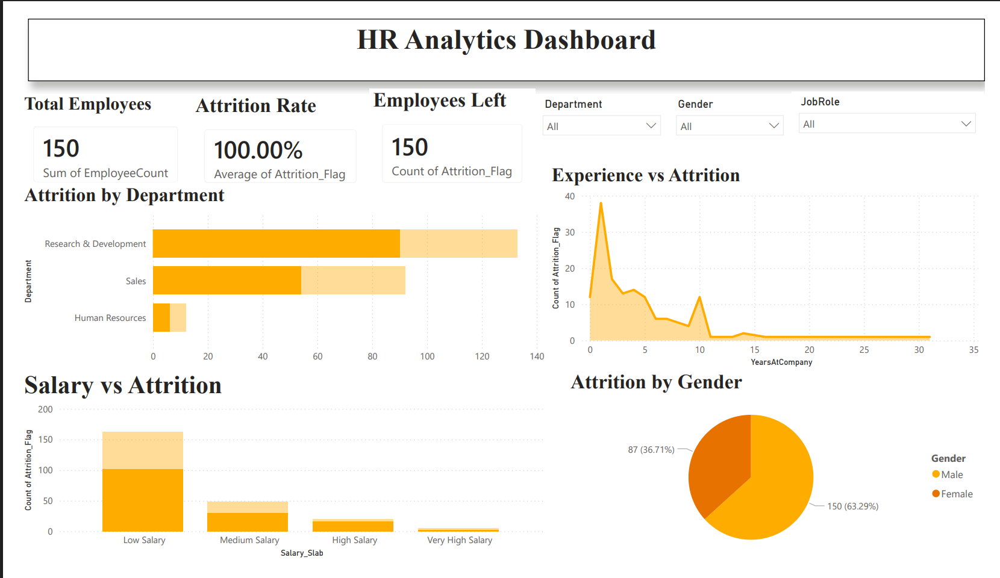

# 📊 HR Analytics Dashboard

An interactive HR Analytics Dashboard developed using **Microsoft Power BI** to analyze employee attrition, workforce trends, and HR insights.

---

## 📸 Dashboard Preview

---

## 🚀 Features

- 👥 Total Employees KPI
- 📉 Attrition Rate
- 🚪 Employees Left KPI
- 🏢 Attrition by Department
- 👨‍💼 Attrition by Gender
- 💰 Salary vs Attrition
- 📈 Experience vs Attrition
- 🎛 Interactive Slicers
  - Department
  - Gender
  - Job Role

---

## 🛠 Technologies Used

- Microsoft Power BI
- Microsoft Excel
- SQL
- Python (Jupyter Notebook)

---

## 📂 Files Included

- HR_Analytics_Anand.pbix
- HR_Analytics_Anand.ipynb
- HR_Attrition_Project_Anand.sql
- HR_Attrition_Cleaned_Final.xlsx
- dashboard.png

---

## 📌 Key Insights

- Research & Development department has the highest attrition.
- Most attrition occurs among employees with low salaries.
- Male employees account for a larger share of attrition.
- Employees with fewer years at the company tend to leave more frequently.

---

## 👨‍💻 Author

**Anand**
